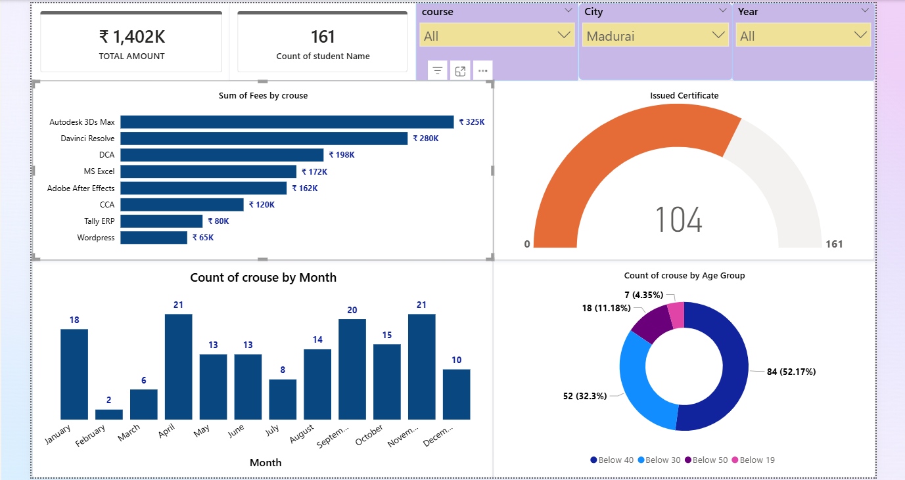

# Academic-Performance-Enrollment-Dashboard
A data-driven dashboard built using Power BI to analyze student enrollment trends, course-wise revenue, certification outcomes, and demographic insights. Enables identification of performance patterns, supports data-driven academic decisions, and improves visibility into student progress and learning outcomes.

